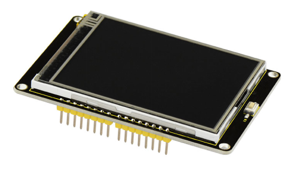
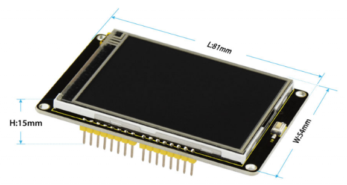
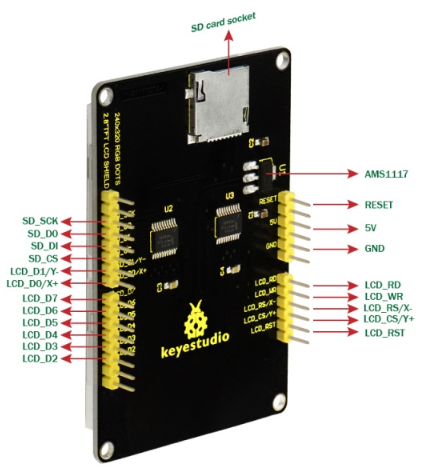
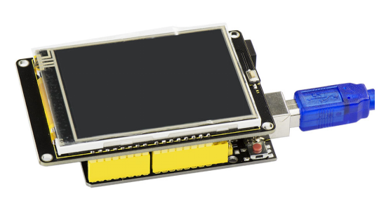
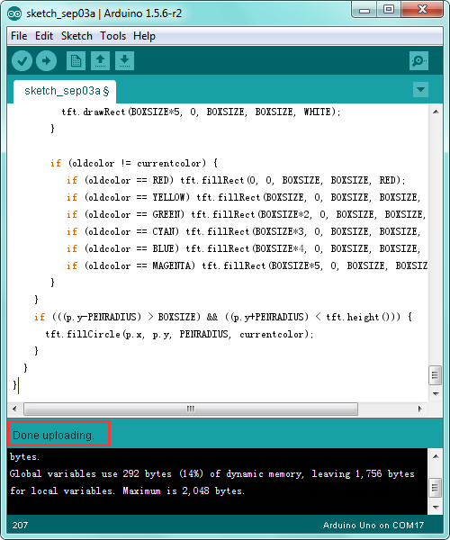
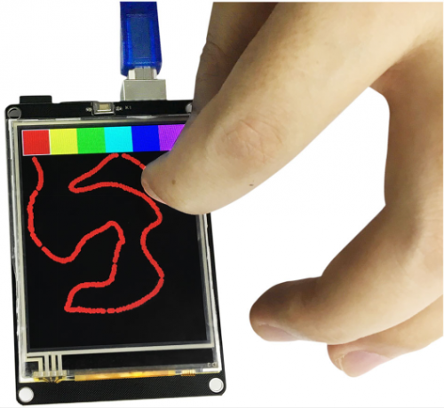

# KS0257 keyestudio 2.8 Inch TFT LCD Shield



## 1. Introduction

This is a keyestudio 2.8 inch TFT LCD shield with touchscreen. This TFT display is driven with ILI9325 chip and has 240x320 pixels with individual RGB pixel control. 

This display has a resistive touchscreen attached to it already, so you can detect finger presses anywhere on the screen. It also comes with a Reset button marked K1 and MicroSD card socket on the back. (microSD card not included, but any will work)

This LCD shield is fully compatible with the Arduino UNO R3, so that you can easily stack it on the board for simple use.

## 2. Technical Details

- Driving duty:1/240 Duty
- 2.8’’ (COG type)
- Viewing angle: 12:00 o’clock
- ILI9325 LCD driver or equivalent
- Logic voltage: 2.8V-3.3V
- Data interface: 80 system 8/16bit bus interface
- TFT LCD Shield: 8 bit bus mode
- Touchscreen
- White LED backlight, transistor connected so you can PWM dim the backlight.
- Power supply: DC 5V

|     Display size      | 2.8" diagonal         |
| :-------------------: | --------------------- |
|    Number of Dots     | W/RGB/H 240×3×320 DOT |
|      Active Area      | W/H 43.2×57.6         |
|      Pixel size       | W/H 0.18×0.18mm       |
|       LCD Type        | TFT                   |
|       Driven IC       | ILI9325               |
| Various color Display | 65K ; 262K            |
|       Backlight       | White                 |
|        Screen         | 69.5mm x 50mm x 5mm   |
|   Board Dimensions    | 81mm x 54mm x15mm     |
|     Approx.Weight     | 38.7g                 |



## 3. PINOUTS



## 4. How to test it

**Connect it Up**

Simply stack the LCD shield onto UNO board , then connect the board to your computer with a USB cable.



**Upload the Code**

**Library files and code download：**[Resources](./Resources.7z)

```c
#include <Adafruit_GFX.h>    // Core graphics library
#include <Adafruit_TFTLCD.h> // Hardware-specific library
#include <SD.h>
#include <SPI.h>


// The control pins for the LCD can be assigned to any digital or
// analog pins...but we'll use the analog pins as this allows us to
// double up the pins with the touch screen (see the TFT paint example).
#define LCD_CS A3 // Chip Select goes to Analog 3
#define LCD_CD A2 // Command/Data goes to Analog 2
#define LCD_WR A1 // LCD Write goes to Analog 1
#define LCD_RD A0 // LCD Read goes to Analog 0
#define PIN_SD_CS 10 // Adafruit SD shields and modules: pin 10

#define LCD_RESET A4 // Can alternately just connect to Arduino's reset pin

// When using the BREAKOUT BOARD only, use these 8 data lines to the LCD:
// For the Arduino Uno, Duemilanove, Diecimila, etc.:
//   D0 connects to digital pin 8  (Notice these are
//   D1 connects to digital pin 9   NOT in order!)
//   D2 connects to digital pin 2
//   D3 connects to digital pin 3
//   D4 connects to digital pin 4
//   D5 connects to digital pin 5
//   D6 connects to digital pin 6
//   D7 connects to digital pin 7
// For the Arduino Mega, use digital pins 22 through 29
// (on the 2-row header at the end of the board).

// Assign human-readable names to some common 16-bit color values:
#define	BLACK   0x0000
#define	BLUE    0x001F
#define	RED     0xF800
#define	GREEN   0x07E0
#define CYAN    0x07FF
#define MAGENTA 0xF81F
#define YELLOW  0xFFE0
#define WHITE   0xFFFF

Adafruit_TFTLCD tft(LCD_CS, LCD_CD, LCD_WR, LCD_RD, LCD_RESET);
// If using the shield, all control and data lines are fixed, and
// a simpler declaration can optionally be used:
// Adafruit_TFTLCD tft;


#define MAX_BMP         10                      // bmp file num
#define FILENAME_LEN    20                      // max file name length

const int __Gnbmp_height = 320;                 // bmp hight
const int __Gnbmp_width  = 240;                 // bmp width

unsigned char __Gnbmp_image_offset  = 0;        // offset

int __Gnfile_num = 4;                           // num of file

char __Gsbmp_files[4][FILENAME_LEN] =           // add file name here
{
"flower.bmp",
"tiger.bmp",
"tree.bmp",
"RedRose.bmp",
};
File bmpFile;

/*********************************************/
// This procedure reads a bitmap and draws it to the screen
// its sped up by reading many pixels worth of data at a time
// instead of just one pixel at a time. increading the buffer takes
// more RAM but makes the drawing a little faster. 20 pixels' worth
// is probably a good place

#define BUFFPIXEL       60                      // must be a divisor of 240 
#define BUFFPIXEL_X3    180                     // BUFFPIXELx3

void bmpdraw(File f, int x, int y)
{
    bmpFile.seek(__Gnbmp_image_offset);

    uint32_t time = millis();

    uint8_t sdbuffer[BUFFPIXEL_X3];                 // 3 * pixels to buffer

    for (int i=0; i< __Gnbmp_height; i++) {
        for(int j=0; j<(240/BUFFPIXEL); j++) {
            bmpFile.read(sdbuffer, BUFFPIXEL_X3);
            
            uint8_t buffidx = 0;
            int offset_x = j*BUFFPIXEL;
            unsigned int __color[BUFFPIXEL];
            
            for(int k=0; k<BUFFPIXEL; k++) {
                __color[k] = sdbuffer[buffidx+2]>>3;                        // read
                __color[k] = __color[k]<<6 | (sdbuffer[buffidx+1]>>2);      // green
                __color[k] = __color[k]<<5 | (sdbuffer[buffidx+0]>>3);      // blue
                
                buffidx += 3;
            }

	    for (int m = 0; m < BUFFPIXEL; m ++) {
              tft.drawPixel(m+offset_x, i,__color[m]);
	    }
        }
    }
    
    Serial.print(millis() - time, DEC);
    Serial.println(" ms");
}

boolean bmpReadHeader(File f) 
{
    // read header
    uint32_t tmp;
    uint8_t bmpDepth;
    
    if (read16(f) != 0x4D42) {
        // magic bytes missing
        return false;
    }

    // read file size
    tmp = read32(f);
    Serial.print("size 0x");
    Serial.println(tmp, HEX);

    // read and ignore creator bytes
    read32(f);

    __Gnbmp_image_offset = read32(f);
    Serial.print("offset ");
    Serial.println(__Gnbmp_image_offset, DEC);

    // read DIB header
    tmp = read32(f);
    Serial.print("header size ");
    Serial.println(tmp, DEC);
    
    int bmp_width = read32(f);
    int bmp_height = read32(f);
    
    if(bmp_width != __Gnbmp_width || bmp_height != __Gnbmp_height)  {    // if image is not 320x240, return false
        return false;
    }

    if (read16(f) != 1)
    return false;

    bmpDepth = read16(f);
    Serial.print("bitdepth ");
    Serial.println(bmpDepth, DEC);

    if (read32(f) != 0) {
        // compression not supported!
        return false;
    }

    Serial.print("compression ");
    Serial.println(tmp, DEC);

    return true;
}

/*********************************************/
// These read data from the SD card file and convert them to big endian
// (the data is stored in little endian format!)

// LITTLE ENDIAN!
uint16_t read16(File f)
{
    uint16_t d;
    uint8_t b;
    b = f.read();
    d = f.read();
    d <<= 8;
    d |= b;
    return d;
}

// LITTLE ENDIAN!
uint32_t read32(File f)
{
    uint32_t d;
    uint16_t b;

    b = read16(f);
    d = read16(f);
    d <<= 16;
    d |= b;
    return d;
}

void setup(void) {
  Serial.begin(9600);
  Serial.println(F("TFT LCD test"));

#ifdef USE_ADAFRUIT_SHIELD_PINOUT
  Serial.println(F("Using Adafruit 2.4\" TFT Arduino Shield Pinout"));
#else
  Serial.println(F("Using Adafruit 2.4\" TFT Breakout Board Pinout"));
#endif

  Serial.print("TFT size is "); Serial.print(tft.width()); Serial.print("x"); Serial.println(tft.height());

  tft.reset();

  uint16_t identifier = tft.readID();
  if(identifier==0x0101)
      identifier=0x9341;
  
  if(identifier == 0x9325) {
    Serial.println(F("Found ILI9325 LCD driver"));
  } else if(identifier == 0x4535) {
    Serial.println(F("Found LGDP4535 LCD driver"));
  }else if(identifier == 0x9328) {
    Serial.println(F("Found ILI9328 LCD driver"));
  } else if(identifier == 0x7575) {
    Serial.println(F("Found HX8347G LCD driver"));
  } else if(identifier == 0x9341) {
    Serial.println(F("Found ILI9341 LCD driver"));
  } else if(identifier == 0x8357) {
    Serial.println(F("Found HX8357D LCD driver"));
  } else {
    Serial.print(F("Unknown LCD driver chip: "));
    Serial.println(identifier, HEX);
    Serial.println(F("If using the Adafruit 2.4\" TFT Arduino shield, the line:"));
    Serial.println(F("  #define USE_ADAFRUIT_SHIELD_PINOUT"));
    Serial.println(F("should appear in the library header (Adafruit_TFT.h)."));
    Serial.println(F("If using the breakout board, it should NOT be #defined!"));
    Serial.println(F("Also if using the breakout, double-check that all wiring"));
    Serial.println(F("matches the tutorial."));
    return;
  }
  
  tft.begin(identifier);
  tft.fillScreen(BLUE);
  
  
  
  //Init SD_Card
  pinMode(10, OUTPUT);
   
  if (!SD.begin(10)) {
    Serial.println("initialization failed!");
    tft.setCursor(0, 0);
    tft.setTextColor(WHITE);    
    tft.setTextSize(1);
    tft.println("SD Card Init fail.");   
  }else
  Serial.println("initialization done."); 
}

void loop(void) {
     for(unsigned char i=0; i<__Gnfile_num; i++) {
        bmpFile = SD.open(__Gsbmp_files[i]);
        if (! bmpFile) {
            Serial.println("didnt find image");
            tft.setTextColor(WHITE);    tft.setTextSize(1);
            tft.println("didnt find BMPimage");
            while (1);
        }
   
        if(! bmpReadHeader(bmpFile)) {
            Serial.println("bad bmp");
            tft.setTextColor(WHITE);    tft.setTextSize(1);
            tft.println("bad bmp");
            return;
        }

        bmpdraw(bmpFile, 0, 0);
        bmpFile.close();
        delay(1000);
        delay(1000);
    }
    
}
```

**Code 2:**

```c
#include <Adafruit_GFX.h>    // Core graphics library
#include <Adafruit_TFTLCD.h> // Hardware-specific library
#include <TouchScreen.h>

#if defined(__SAM3X8E__)
    #undef __FlashStringHelper::F(string_literal)
    #define F(string_literal) string_literal
#endif

// When using the BREAKOUT BOARD only, use these 8 data lines to the LCD:
// For the Arduino Uno, Duemilanove, Diecimila, etc.:
//   D0 connects to digital pin 8  (Notice these are
//   D1 connects to digital pin 9   NOT in order!)
//   D2 connects to digital pin 2
//   D3 connects to digital pin 3
//   D4 connects to digital pin 4
//   D5 connects to digital pin 5
//   D6 connects to digital pin 6
//   D7 connects to digital pin 7

// For the Arduino Mega, use digital pins 22 through 29
// (on the 2-row header at the end of the board).
//   D0 connects to digital pin 22
//   D1 connects to digital pin 23
//   D2 connects to digital pin 24
//   D3 connects to digital pin 25
//   D4 connects to digital pin 26
//   D5 connects to digital pin 27
//   D6 connects to digital pin 28
//   D7 connects to digital pin 29

// For the Arduino Due, use digital pins 33 through 40
// (on the 2-row header at the end of the board).
//   D0 connects to digital pin 33
//   D1 connects to digital pin 34
//   D2 connects to digital pin 35
//   D3 connects to digital pin 36
//   D4 connects to digital pin 37
//   D5 connects to digital pin 38
//   D6 connects to digital pin 39
//   D7 connects to digital pin 40

#define YP A3  // must be an analog pin, use "An" notation!
#define XM A2  // must be an analog pin, use "An" notation!
#define YM 9   // can be a digital pin
#define XP 8   // can be a digital pin

#define TS_MINX 150
#define TS_MINY 120
#define TS_MAXX 920
#define TS_MAXY 940

// For better pressure precision, we need to know the resistance
// between X+ and X- Use any multimeter to read it
// For the one we're using, its 300 ohms across the X plate
TouchScreen ts = TouchScreen(XP, YP, XM, YM, 300);

#define LCD_CS A3
#define LCD_CD A2
#define LCD_WR A1
#define LCD_RD A0
// optional
#define LCD_RESET A4

// Assign human-readable names to some common 16-bit color values:
#define	BLACK   0x0000
#define	BLUE    0x001F
#define	RED     0xF800
#define	GREEN   0x07E0
#define CYAN    0x07FF
#define MAGENTA 0xF81F
#define YELLOW  0xFFE0
#define WHITE   0xFFFF


Adafruit_TFTLCD tft(LCD_CS, LCD_CD, LCD_WR, LCD_RD, LCD_RESET);

#define BOXSIZE 40
#define PENRADIUS 3
int oldcolor, currentcolor;

void setup(void) {
  Serial.begin(9600);
  Serial.println(F("Paint!"));
  
  tft.reset();
  
  uint16_t identifier = tft.readID();
 if(identifier==0x0101)
      identifier=0x9341;
  if(identifier == 0x9325) {
    Serial.println(F("Found ILI9325 LCD driver"));
  } else if(identifier == 0x9328) {
    Serial.println(F("Found ILI9328 LCD driver"));
  } else if(identifier == 0x4535) {
    Serial.println(F("Found LGDP4535 LCD driver"));
  }else if(identifier == 0x7575) {
    Serial.println(F("Found HX8347G LCD driver"));
  } else if(identifier == 0x9341) {
    Serial.println(F("Found ILI9341 LCD driver"));
  } else if(identifier == 0x8357) {
    Serial.println(F("Found HX8357D LCD driver"));
  } else {
    Serial.print(F("Unknown LCD driver chip: "));
    Serial.println(identifier, HEX);
    Serial.println(F("If using the Adafruit 2.8\" TFT Arduino shield, the line:"));
    Serial.println(F("  #define USE_ADAFRUIT_SHIELD_PINOUT"));
    Serial.println(F("should appear in the library header (Adafruit_TFT.h)."));
    Serial.println(F("If using the breakout board, it should NOT be #defined!"));
    Serial.println(F("Also if using the breakout, double-check that all wiring"));
    Serial.println(F("matches the tutorial."));
    return;
  }

  tft.begin(identifier);

  tft.fillScreen(BLACK);

  tft.fillRect(0, 0, BOXSIZE, BOXSIZE, RED);
  tft.fillRect(BOXSIZE, 0, BOXSIZE, BOXSIZE, YELLOW);
  tft.fillRect(BOXSIZE*2, 0, BOXSIZE, BOXSIZE, GREEN);
  tft.fillRect(BOXSIZE*3, 0, BOXSIZE, BOXSIZE, CYAN);
  tft.fillRect(BOXSIZE*4, 0, BOXSIZE, BOXSIZE, BLUE);
  tft.fillRect(BOXSIZE*5, 0, BOXSIZE, BOXSIZE, MAGENTA);
  // tft.fillRect(BOXSIZE*6, 0, BOXSIZE, BOXSIZE, WHITE);
 
  tft.drawRect(0, 0, BOXSIZE, BOXSIZE, WHITE);
  currentcolor = RED;
 
  pinMode(13, OUTPUT);
}

#define MINPRESSURE 10
#define MAXPRESSURE 1000

void loop()
{
  digitalWrite(13, HIGH);
  TSPoint p = ts.getPoint();
  digitalWrite(13, LOW);

  // if sharing pins, you'll need to fix the directions of the touchscreen pins
  //pinMode(XP, OUTPUT);
  pinMode(XM, OUTPUT);
  pinMode(YP, OUTPUT);
  //pinMode(YM, OUTPUT);

  // we have some minimum pressure we consider 'valid'
  // pressure of 0 means no pressing!

  if (p.z > MINPRESSURE && p.z < MAXPRESSURE) {
    /*
    Serial.print("X = "); Serial.print(p.x);
    Serial.print("\tY = "); Serial.print(p.y);
    Serial.print("\tPressure = "); Serial.println(p.z);
    */
    
    if (p.y < (TS_MINY-5)) {
      Serial.println("erase");
      // press the bottom of the screen to erase 
      tft.fillRect(0, BOXSIZE, tft.width(), tft.height()-BOXSIZE, BLACK);
    }
    // scale from 0->1023 to tft.width
    p.x = map(p.x, TS_MINX, TS_MAXX, tft.width(), 0);
    p.y = map(p.y, TS_MINY, TS_MAXY, tft.height(), 0);
    /*
    Serial.print("("); Serial.print(p.x);
    Serial.print(", "); Serial.print(p.y);
    Serial.println(")");
    */
    if (p.y < BOXSIZE) {
       oldcolor = currentcolor;

       if (p.x < BOXSIZE) { 
         currentcolor = RED; 
         tft.drawRect(0, 0, BOXSIZE, BOXSIZE, WHITE);
       } else if (p.x < BOXSIZE*2) {
         currentcolor = YELLOW;
         tft.drawRect(BOXSIZE, 0, BOXSIZE, BOXSIZE, WHITE);
       } else if (p.x < BOXSIZE*3) {
         currentcolor = GREEN;
         tft.drawRect(BOXSIZE*2, 0, BOXSIZE, BOXSIZE, WHITE);
       } else if (p.x < BOXSIZE*4) {
         currentcolor = CYAN;
         tft.drawRect(BOXSIZE*3, 0, BOXSIZE, BOXSIZE, WHITE);
       } else if (p.x < BOXSIZE*5) {
         currentcolor = BLUE;
         tft.drawRect(BOXSIZE*4, 0, BOXSIZE, BOXSIZE, WHITE);
       } else if (p.x < BOXSIZE*6) {
         currentcolor = MAGENTA;
         tft.drawRect(BOXSIZE*5, 0, BOXSIZE, BOXSIZE, WHITE);
       }

       if (oldcolor != currentcolor) {
          if (oldcolor == RED) tft.fillRect(0, 0, BOXSIZE, BOXSIZE, RED);
          if (oldcolor == YELLOW) tft.fillRect(BOXSIZE, 0, BOXSIZE, BOXSIZE, YELLOW);
          if (oldcolor == GREEN) tft.fillRect(BOXSIZE*2, 0, BOXSIZE, BOXSIZE, GREEN);
          if (oldcolor == CYAN) tft.fillRect(BOXSIZE*3, 0, BOXSIZE, BOXSIZE, CYAN);
          if (oldcolor == BLUE) tft.fillRect(BOXSIZE*4, 0, BOXSIZE, BOXSIZE, BLUE);
          if (oldcolor == MAGENTA) tft.fillRect(BOXSIZE*5, 0, BOXSIZE, BOXSIZE, MAGENTA);
       }
    }
    if (((p.y-PENRADIUS) > BOXSIZE) && ((p.y+PENRADIUS) < tft.height())) {
      tft.fillCircle(p.x, p.y, PENRADIUS, currentcolor);
    }
  }
}
```



## 5. What you should see?

First put the picture into SD card using the card reader and then insert the SD card inside the shield. Stack well the LCD shield onto the UNO R3. After power on and upload the code 1 to UNO board, you should see the picture is displayed on the LCD screen. Below is some example pictures.


Done uploading the code 2 to UNO board, you could select different colors to draw various shapes on the LCD screen with your fingers. Shown below.

